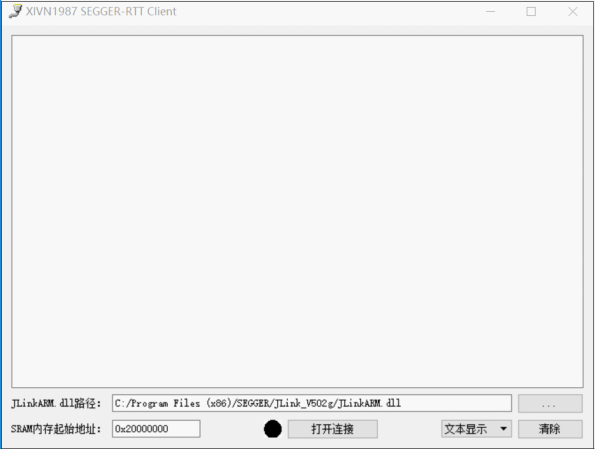
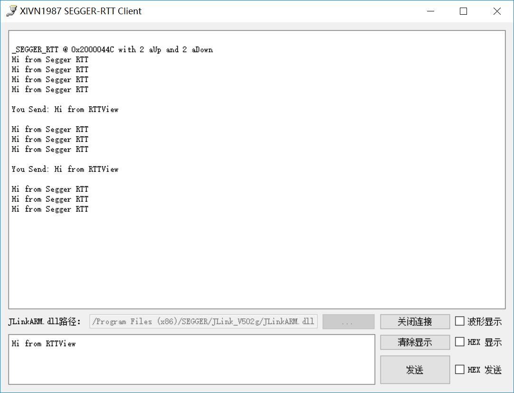

# RTTView
SEGGER-RTT Client for J-LINK and DAPLink

To run software, you need python 3.6+, pyqt5 and pyqtchart.

To use DAPLink, you need additional pyusb for CMSIS-DAPv2 and another usb-backend for CMSIS-DAPv1 (hidapi or pywinusb for windows, hidapi for mac, pyusb for linux).

``` shell
pip install PyQt5 PyQtChart pyusb hidapi six
```



data format for wave show:
+ 1 wave: 11, 22, 33,
+ 2 wave: 11 22, 33 44, 55 66,
+ 3 wave: 11 22 33, 44 55 66, 77 88 99,
+ 4 wave: 11 22 33 44, 55 66 77 88, 99 11 22 33,


## Variable read directly
When select map file path in address combobox, RTTView read selected variable directly from memory at specified address, rather from RTT buffer.



Double-click the table cell to bring up the variable adding dialog.
